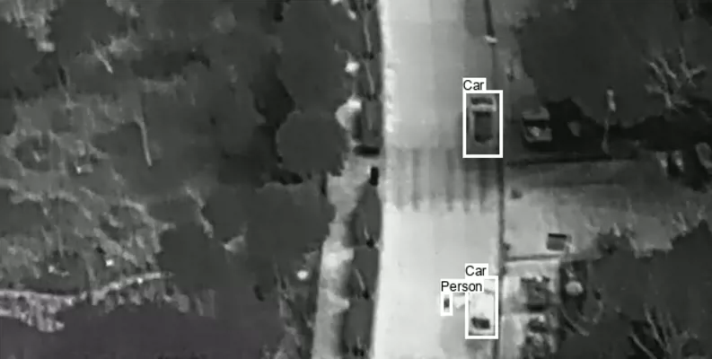
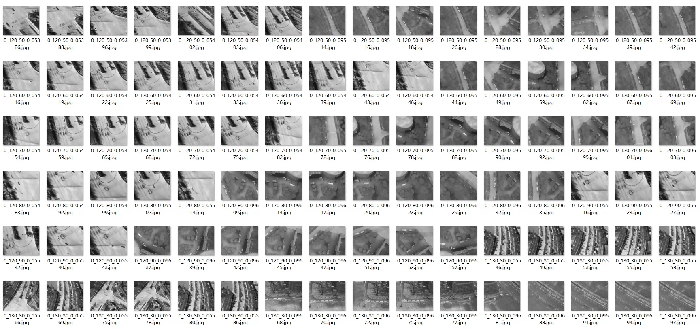
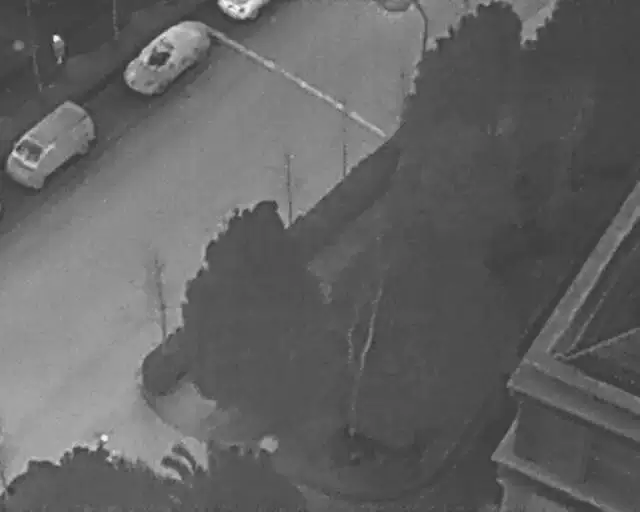
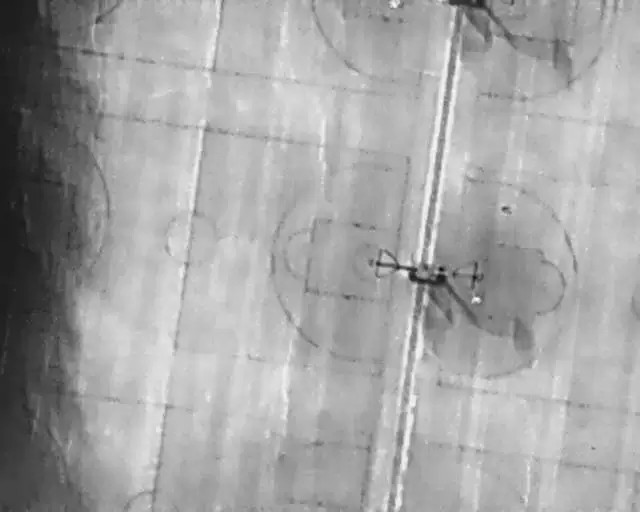
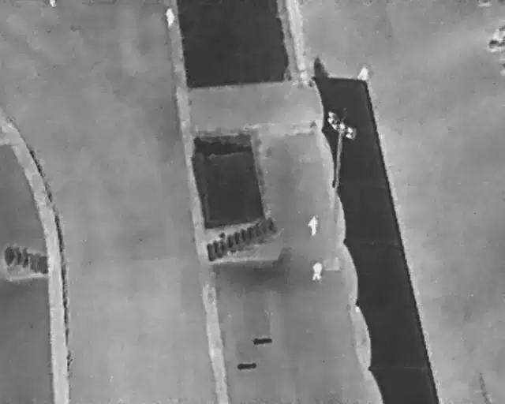
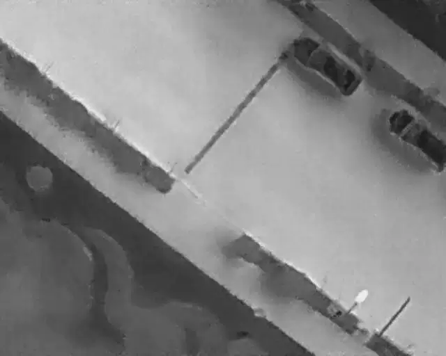

## Body

UAV High-Altitude Infrared Thermal Imaging Dataset - YOLO format

This dataset contains 2898 thermal infrared images extracted from 43,470 frames. These images were captured by drones from various scenes (schools, parking lots, roads, amusement parks, etc.), covering a wide range of objects (humans, bicycles, cars, other vehicles), flight height data (60 to 130 meters), camera perspective data (30 to 90 degrees), and sunlight intensity (daytime and nighttime).

Image size: 640 * 512

The dataset is divided into 5 categories:
0: Person
1: Car
2: Bicycle
3: OtherVehicle
4: DontCare

Electronic virtual products are sold without return or exchange.

## Images

item_1037837785592

Here is a pay link on Stripe ( https://buy.stripe.com/3cs8yP7sY87d0vu9AB ). Please contact me lonlonago@foxmail.com after funding $89, and I will send you a complete data files , thank you!

